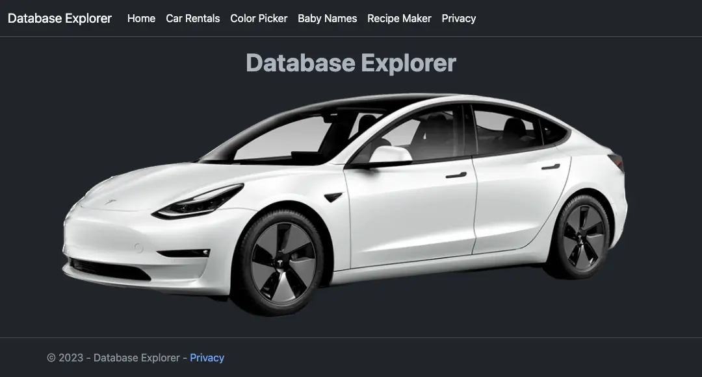
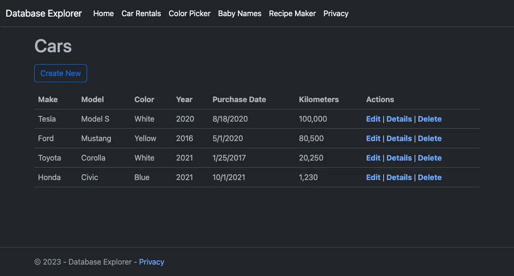
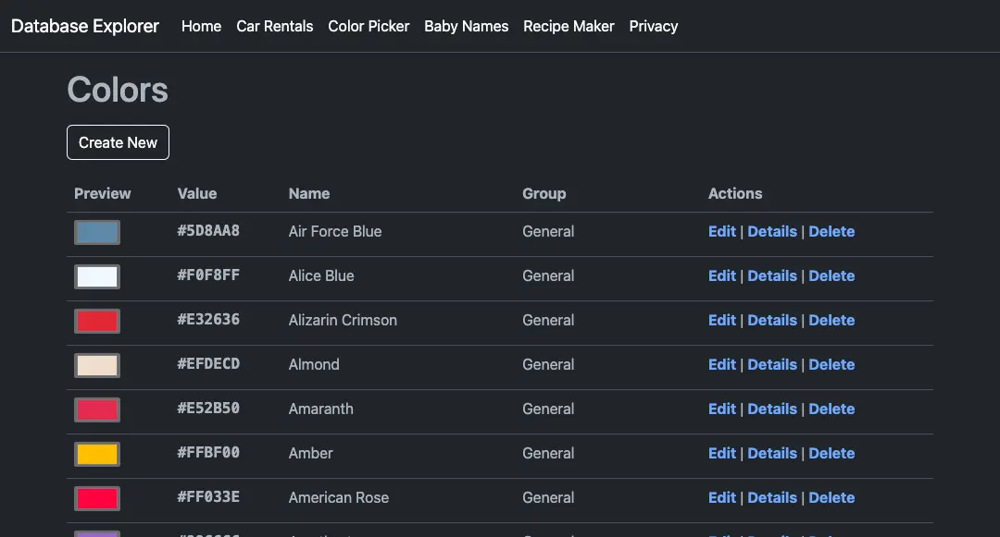
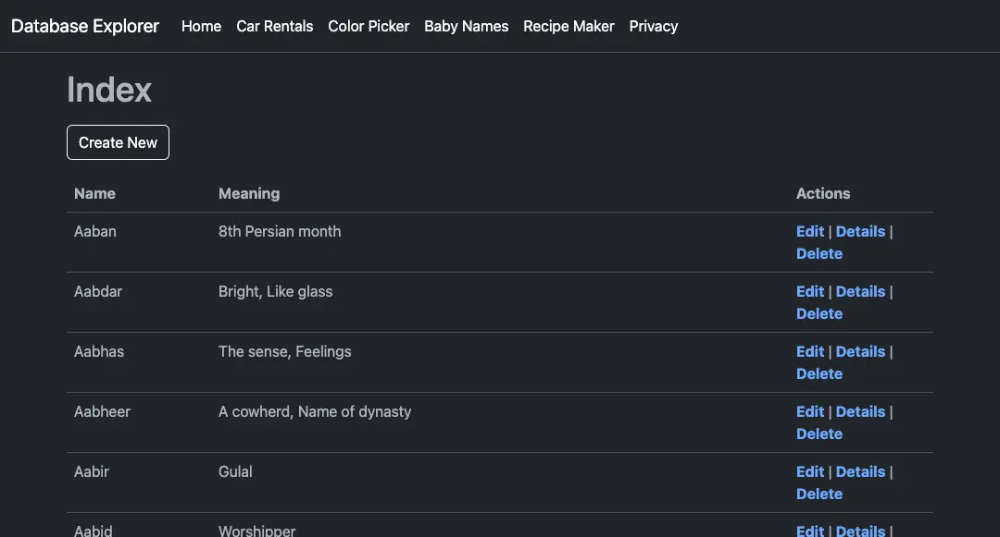
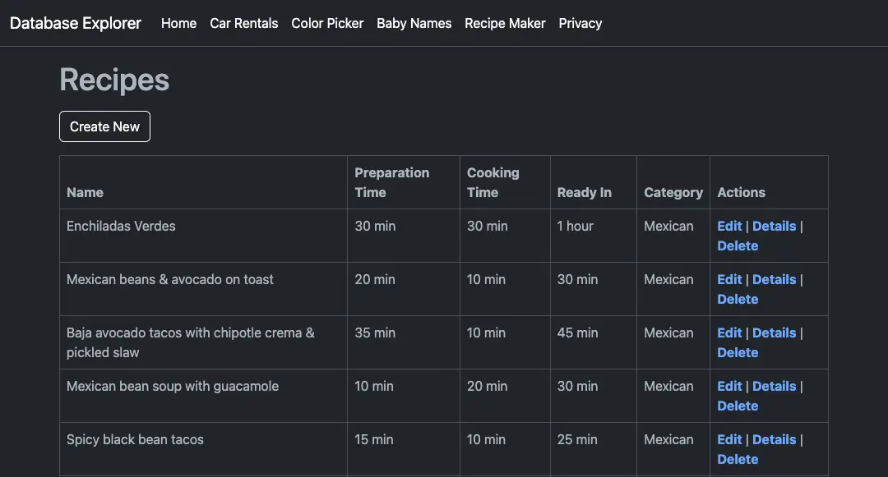
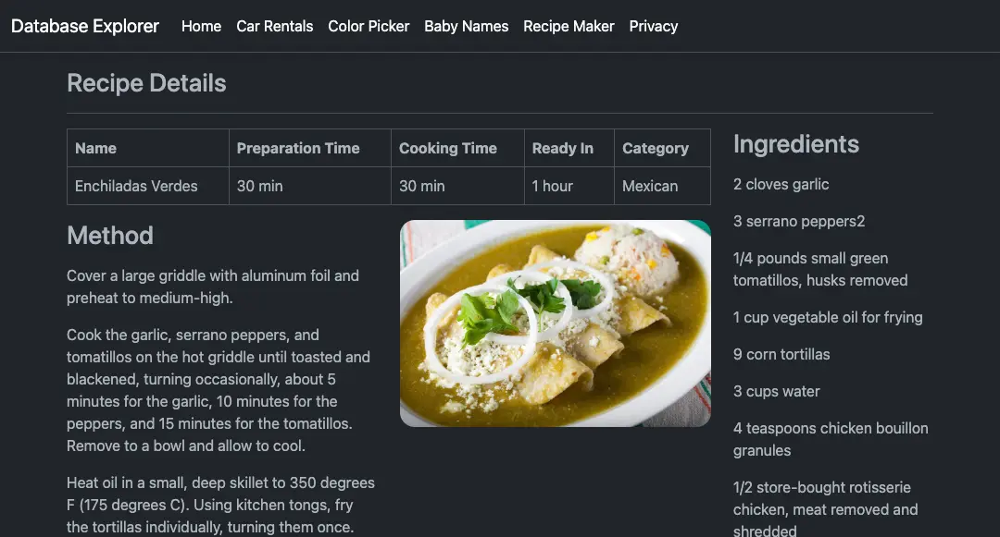

# Database Explorer

Play with different databases using .net scaffolding and migration.

## CarRentals

Rent your first car with car rentals. Demonstrates ASP.NET standalone website
with SQLite3.

The app is stand alone and does not require any initial setup. Uses
ephemeral-ish database which can be created and populated every time (if not
exists).

## ColorPicker

Select color of your choice by their name of hex value from the collection of
over 1000 colors.

The app is stand alone and does not require any initial setup. Uses SQLite3
database with migrations.

## Baby Names

Find out best name for babies. App helps you decide your baby name. Choose your
baby name effortlessly. (Mostly Indian names)

The app is stand alone and does not require any initial setup. Uses SQLite3
database with migrations.

## RecipeMaker

Learn how to prepare food with more then 200 available recipes, Create and add
your own recipe to the app.

The app is stand alone and does not require any initial setup. Uses SQLite3
database with migrations.

